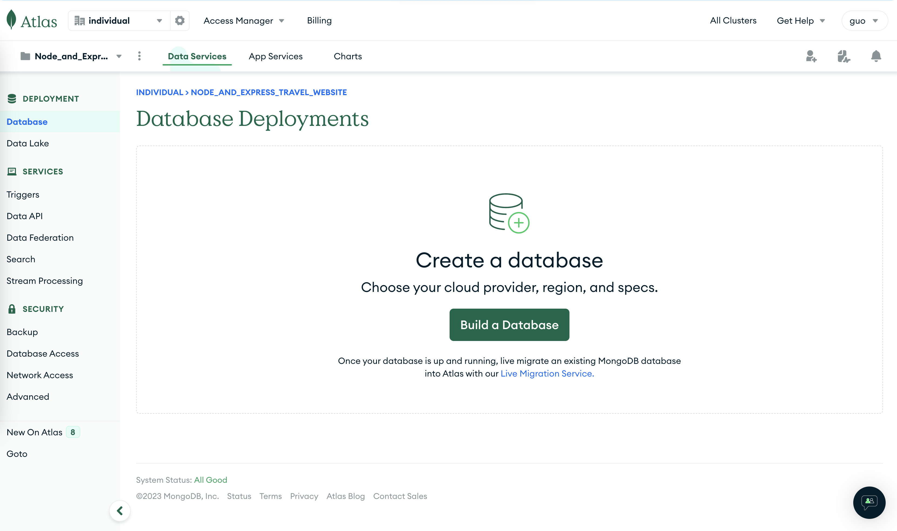
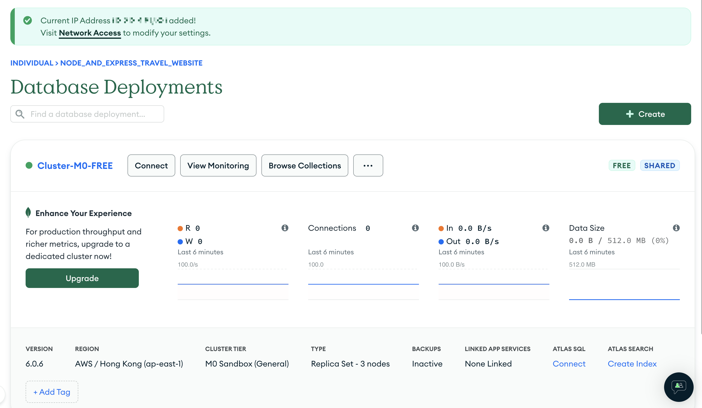
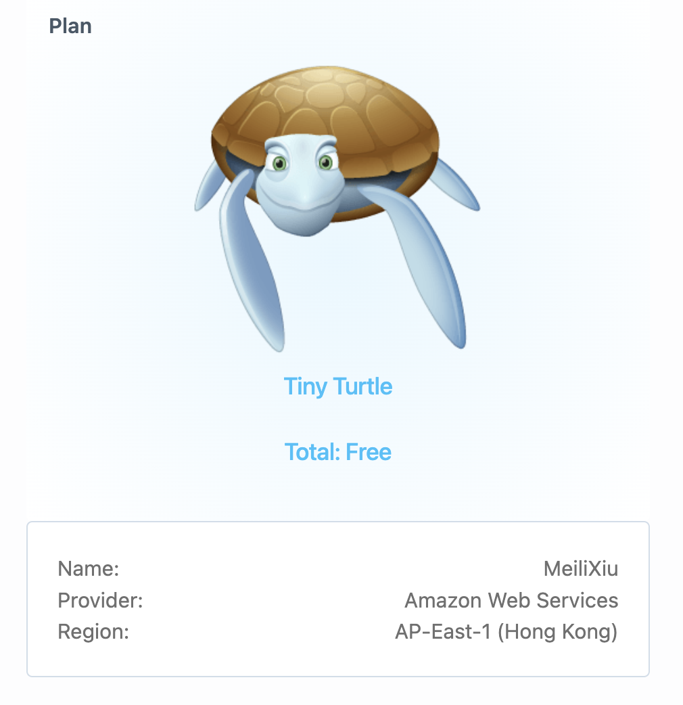

# MeiliXiu


<br>
<br>
<br>
<br>


## Test:

- Jest
- Mocha
- Jasmine
- Ava
- Tape

  ```javascript
  (base) 192:MeiliXiu gsq$ npm test

  > meilixiu@1.0.0 test
  > jest

  PASS  lib/__tests__/handlers.test.js
  ✓ Home Page Renders (2 ms)

  Test Suites: 1 passed, 1 total
  Tests:       1 passed, 1 total
  Snapshots:   0 total
  Time:        0.471 s
  Ran all test suites.
  ```
  
- & Coverage Test  
  
  ```javascript
  (base) 192:MeiliXiu gsq$ npm test -- --coverage

  > meilixiu@1.0.0 test
  > jest "--coverage"

  PASS  lib/__tests__/handlers.test.js
  ✓ Home Page Renders (3 ms)
  ✓ About Page Renders With Rand (1 ms)
  ✓ 404 Page Renders
  ✓ 500 Page Renders (1 ms)

  ----------------|---------|----------|---------|---------|-------------------
  File            | % Stmts | % Branch | % Funcs | % Lines | Uncovered Line #s 
  ----------------|---------|----------|---------|---------|-------------------
  All files       |     100 |      100 |     100 |     100 |     
  handlers.js     |     100 |      100 |     100 |     100 |     
  luckyNumber.js  |     100 |      100 |     100 |     100 |     
  ----------------|---------|----------|---------|---------|-------------------
  Test Suites: 1 passed, 1 total
  Tests:       4 passed, 4 total
  Snapshots:   0 total
  Time:        0.535 s, estimated 1 s
  Ran all test suites.  
  ```


<br>
<br>
<br>

---

## Cookie & Session

In project directory:

  ```javascript
  const env = process.env.NODE_ENV || 'development'
  const credentials = require(`./.credentials.${env}`)

  module.exports = { credentials }
  ```

- To import configure files, use `const { credentials } = require('./config')`

<br>
<br>
<br>

---

## Email: SMTP

With [SendCloud](https://www.sendcloud.net/doc/email_v2/code/) and node:Nodemailer

  ```javascript
  mail sent successfully:  {
    accepted: [ '2404290928@qq.com', 'rong5hui@163.com' ],
    rejected: [],
    ehlo: [
      'PIPELINING',
      '8BITMIME',
      'SMTPUTF8',
      'SIZE 73400320',
      'AUTH LOGIN'
    ],
    envelopeTime: 33,
    messageTime: 67,
    messageSize: 705,
    response: '250 #1688230984071_207464_103258_3427.sc-10_9_40_164-inbound#Queued',
    envelope: {
      from: 'sendcloud@mail.sendcloud.net',
      to: [ '2404290928@qq.com', 'rong5hui@163.com' ]
    },
    messageId: '<d73fd563-7529-cf85-a767-bf2804eb004e@mail.sendcloud.net>'
  }
  ```

<br>
<b>Email Templates</b>: res.render()

<br>
<br>

## Database Persistence

- ### File System
- ### MongoDB, mLab, SANDBOX


  
  

  - MongoDB & Mongoose:
    1. [Getting Started with MongoDB &amp; Mongoose | MongoDB](https://www.mongodb.com/developer/languages/javascript/getting-started-with-mongodb-and-mongoose/)
    2. [Mongoose v7.3.2: Connecting to MongoDB (mongoosejs.com)](https://mongoosejs.com/docs/connections.html)
    3. [Mongoose 基本用法 - 简书 (jianshu.com)](https://www.jianshu.com/p/149faf0fa491)
    4. NoSQLBooster [NoSQLBooster - The Smartest GUI Tool and IDE for MongoDB](https://nosqlbooster.com/)
  - (username & password) MongoDB > Database Access
- ### PostgreSQL > ElephantSQL
    

  - Relational Database should be initialized first.
    ```javascript
    creating database schema
    seeding vacations completed
    3  vacations now
    ```  
- ### Switch MongoDB and PostgresSQL with different module.exports 
  Connect Mongo Database and PostgresSQL Database at the same time   
  At the first time, Postgres should be `node database-relational-init.js`.  